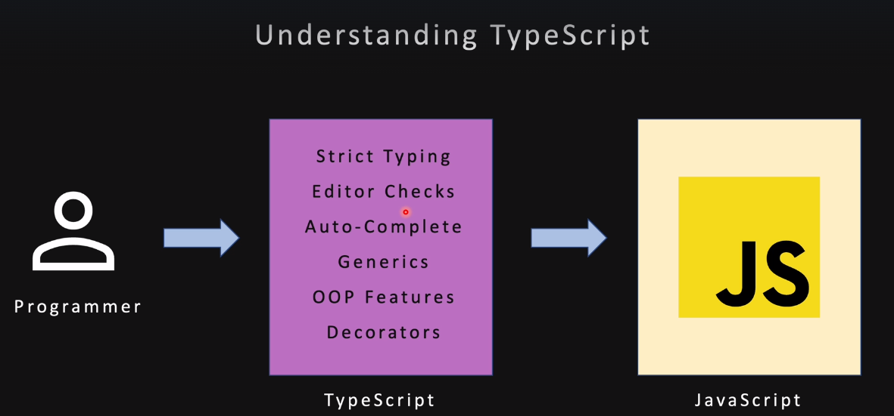
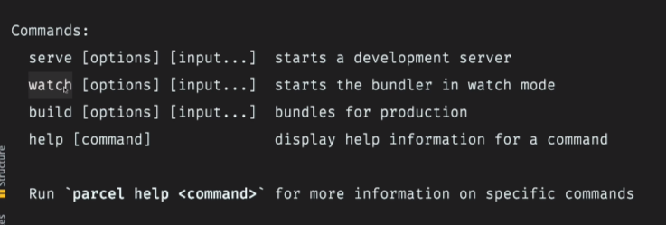

### intro

- tsc --init //generates tsconfig.json
- tsc file.ts // compiles the ts file and generates a js file
- tsc --noEmitOnError file.ts // if any error is found js won't be generated
- same can be done in tsconfig.json -- "noEmitOnError": true, and then enter tsc -p ./tsconfig.json in cmd line

### target js can be managed by the below prop in tsconfig

/_ Language and Environment _/
"target": "es2016",

### Compile with parcel

